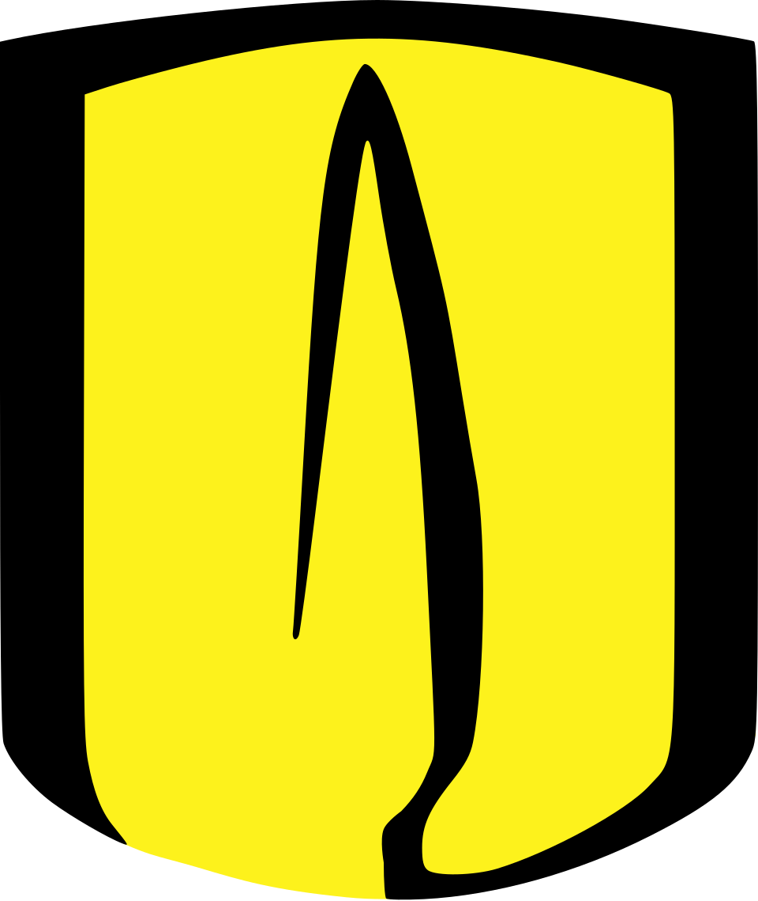

<div align="center">

<!-- Header Animado -->


<br/>

[](https://www.linkedin.com/in/mhgualdron)
[](mailto:mhernandezgualdron@gmail.com)
[](https://github.com/mhgualdron)

</div>

---

## 👨‍💻 About

I am an **AI Engineer** and **Data Scientist** passionate about building intelligent systems. I specialize in the design and deployment of solutions based on **Generative AI**, **Intelligent Automation**, and **MLOps**.



🎓 **M.Sc. in Artificial Intelligence**
Universidad de los Andes • *Expected 2026*
🏆 Coomeva Group Excellence Scholarship

<br clear="right"/>

---

## 🛠️ Tech Stack

<div align="center">

### 🤖 AI & Machine Learning


### ☁️ Cloud & DevOps


### 💻 Languages


### ⚡ Tools


</div>

---

## 🎯 What I Do

<div align="center">

| 🤖 **Generative AI** | 🔄 **MLOps** | 📊 **Data Science** |
|:---:|:---:|:---:|
| LLM Agents & RAG | CI/CD Pipelines | Data Science |
| Chain-of-Thought | Docker & AWS | Dashboards & BI |
| Prompt Engineering | Model Tracking | Predictive Models: ML & DL |

</div>

---

## 🚀 Current Focus

```python
class CurrentWork:
    ai_agents = ["LangGraph", "LangChain", "RAG Architectures"]
    cloud = ["AWS", "GCP", "Azure"]
    optimization = ["Go Microservices", "Real-time Inference"]
    research = "M.Sc. AI @ Universidad de los Andes"
```

---

## 📈 GitHub Stats

<div align="center">
  
<!-- Metrics by Lowlighter (Robust alternative) -->


</div>

---

## 🌍 Let's Connect

<div align="center">


</div>

<div align="center">


</div>
